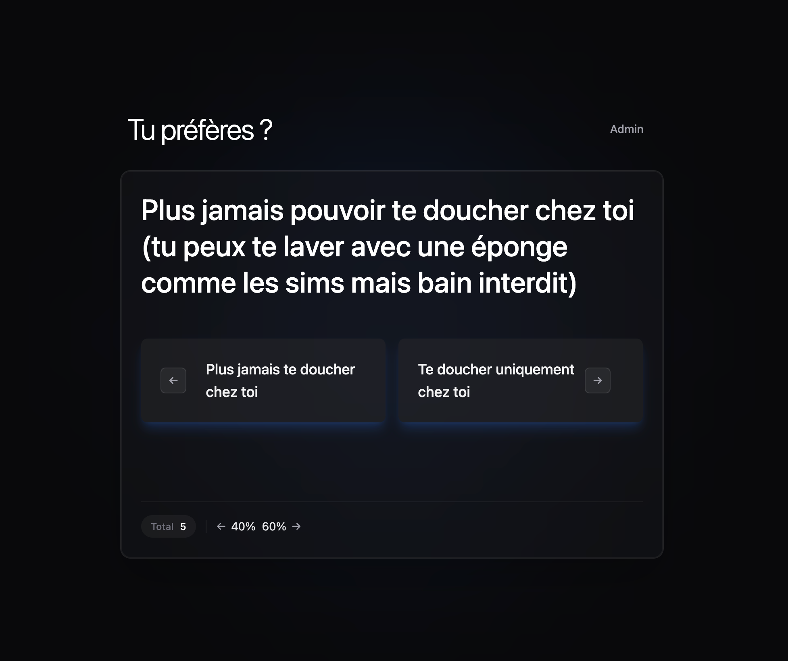

# Tu preferes



## Installation

```bash
bun install
```

## Configuration

### 1. Variables d'environnement client (.env.local)

Créez un fichier `.env.local` à la racine du projet :

```env
VITE_CONVEX_URL=<votre-url-convex>
```

| Variable          | Requis | Description               |
| ----------------- | ------ | ------------------------- |
| `VITE_CONVEX_URL` | Oui    | URL de déploiement Convex |

### 2. Variable d'environnement Convex (serveur)

Le PIN admin est uniquement configuré côté Convex :

```bash
bunx convex env set ADMIN_PIN <votre-pin-admin>
```

Pour vérifier la configuration :

```bash
bunx convex env list
```

## Démarrage

```bash
# Terminal 1 : Convex en mode développement
bunx run convex:dev

# Terminal 2 : Application Vite
bun run dev
```

## Authentification Admin

Le système utilise un PIN simple pour protéger l'accès admin :

### Côté client

1. L'utilisateur entre le PIN sur la page `/admin`
2. Le PIN est vérifié via une mutation Convex
3. Un token de session est stocké en localStorage après validation
4. Le token est envoyé avec chaque mutation admin

### Côté serveur (Convex)

1. `ADMIN_PIN` est requis dans les variables d'environnement Convex
2. La mutation de login vérifie le PIN et crée un token
3. Chaque mutation admin vérifie le token de session
4. Si le token est invalide ou expiré, la requête est rejetée

### Flux de vérification

```
Client                                    Serveur (Convex)
   │                                           │
   │  1. Utilisateur entre PIN                 │
   │  2. Mutation login (pin) ─────────────►   │
   │                                           │  3. Vérifie PIN vs ADMIN_PIN
   │                                           │  4. Crée un token de session
   │  ◄────────── Token + expiration ───────   │
   │  5. Stockage token en localStorage        │
   │                                           │
   │  ────── Mutation (avec token) ────────►   │
   │                                           │  6. Vérifie token
   │                                           │  7. Exécute ou rejette
   │  ◄────────── Réponse ──────────────────   │
```

### Sécurité

- ⚠️ **Disclaimer (connu et assumé)** : ce mécanisme reste volontairement "léger" et **ne constitue pas une authentification/autorisation robuste**. Le token est stocké en localStorage : un utilisateur motivé (ou ayant accès au navigateur / au build) peut le récupérer ou contourner des protections UI. Il n'y a pas de comptes, de sessions serveur avancées (rotation, audit, etc.).

- Le PIN n'est jamais exposé côté client
- Sans le bon PIN serveur, aucune session admin n'est créée
- Les mutations admin exigent un token valide
- Les sessions expirent automatiquement (24h)

## Scripts

| Commande               | Description                           |
| ---------------------- | ------------------------------------- |
| `bun run dev`          | Démarrer le serveur de développement  |
| `bun run convex:dev`   | Démarrer Convex en mode développement |
| `bun run build`        | Build de production                   |
| `bun run typecheck`    | Vérification TypeScript               |
| `bun run lint`         | Linting avec oxlint                   |
| `bun run format`       | Formatage avec Prettier               |
| `bun run format:check` | Vérifier le formatage                 |
| `bun run test`         | Lancer les tests avec Vitest          |
| `bun run seed`         | Peupler la base avec des exemples     |
